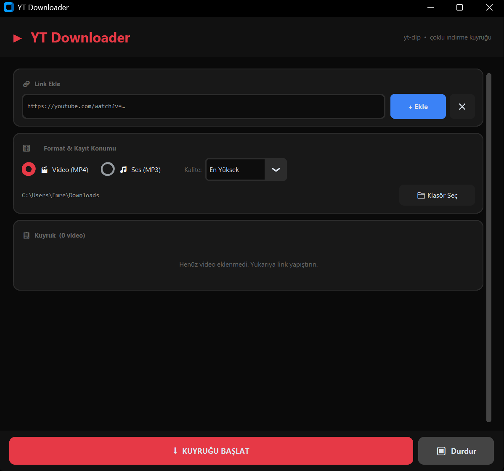
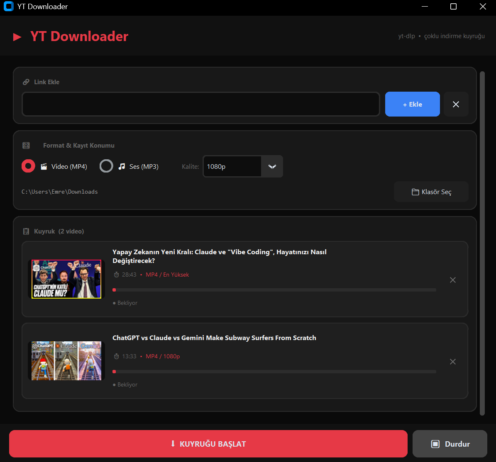

<div align="center">

# ▶ YT Downloader

**YouTube videolarını ve seslerini indirmek için temiz, koyu temalı bir masaüstü uygulaması — yerel, gizli, hızlı.**

yt-dlp · CustomTkinter · FFmpeg · PyInstaller

<br>

🌐 [For English README click here / İngilizce README için tıklayın](README.md)

</div>

---

## ✨ Özellikler

- 🎬 **Video indirme** — Kalite seçimiyle MP4 (En Yüksek / 1080p / 720p / 480p / 360p)
- 🎵 **Ses çıkarma** — 192kbps MP3
- 🖼️ **Video önizleme** — Kapak fotoğrafı, başlık ve süre otomatik yüklenir
- 📋 **İndirme kuyruğu** — Birden fazla link ekle, sırayla indirir
- ⏹ **İptal butonu** — Aktif indirmeyi anında durdur
- 📁 **Özel kayıt klasörü** — İstediğin dizini seç
- 🔇 **Reklam yok, takip yok** — %100 yerel, YouTube sunucularına doğrudan bağlanır

---

## 🖥️ Ekran Görüntüleri

| Ana Arayüz | İndirme Ekranı |
|---|---|
|  |  |

---

## ⚡ Hızlı Başlangıç

### Gereksinimler
- Python 3.8+
- FFmpeg (MP3 ve yüksek kaliteli video için zorunlu)

### Bağımlılıkları kur

```bash
pip install yt-dlp customtkinter Pillow
```

### Çalıştır

```bash
python youtube_downloader.py
```

---

## 📦 Portable EXE Oluştur

### 1. PyInstaller'ı kur

```bash
pip install pyinstaller
```

### 2. İkon dönüştür (isteğe bağlı)

```bash
python -c "from PIL import Image; img = Image.open('icon.png').convert('RGBA'); img.save('icon.ico', format='ICO', sizes=[(16,16),(32,32),(48,48),(64,64),(128,128),(256,256)])"
```

### 3. EXE oluştur

```bash
python -m PyInstaller --onefile --windowed --name "YT-Downloader" --icon="icon.ico" youtube_downloader.py
```

EXE dosyası `dist/` klasöründe oluşur.

### 4. Portable paket (arkadaşlarla paylaş)

```
📁 YTDownloader-Portable/
   ├── YT-Downloader.exe
   ├── ffmpeg.exe
   ├── ffplay.exe
   └── ffprobe.exe
```

> Bu 4 dosyayı zip'le ve paylaş. Hedef bilgisayarda kurulum gerekmez.

---

## 🔧 FFmpeg Kurulumu (Windows)

1. [gyan.dev/ffmpeg/builds](https://www.gyan.dev/ffmpeg/builds/) adresinden `ffmpeg-release-essentials.zip` indir
2. İçindeki `ffmpeg.exe`, `ffplay.exe`, `ffprobe.exe` dosyalarını `C:\ffmpeg\bin\` klasörüne koy
3. `C:\ffmpeg\bin` yolunu sistem PATH'ine ekle
4. Doğrula: `ffmpeg -version`

---

## 🛠️ Teknoloji Yığını

| Bileşen | Teknoloji |
|---|---|
| İndirme motoru | [yt-dlp](https://github.com/yt-dlp/yt-dlp) |
| GUI çerçevesi | [CustomTkinter](https://github.com/TomSchimansky/CustomTkinter) |
| Görsel işleme | [Pillow](https://python-pillow.org/) |
| Video işleme | [FFmpeg](https://ffmpeg.org/) |
| Paketleme | [PyInstaller](https://pyinstaller.org/) |

---

## ⚠️ Yasal Uyarı

Bu araç yalnızca **kişisel kullanım** içindir.
YouTube Kullanım Koşulları'na saygı gösterin. Ticari dağıtım için kullanmayın.

---

## 📄 Lisans

MIT Lisansı — özgürce kullan, değiştir ve dağıt.

<div align="center">
<br>
❤️ ile yapıldı · yt-dlp ile güçlendirildi
</div>
